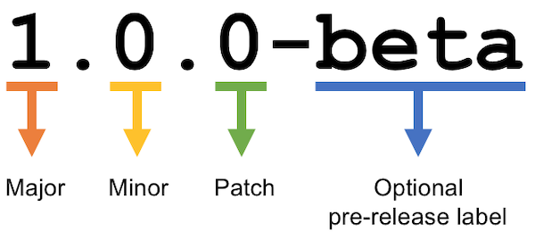
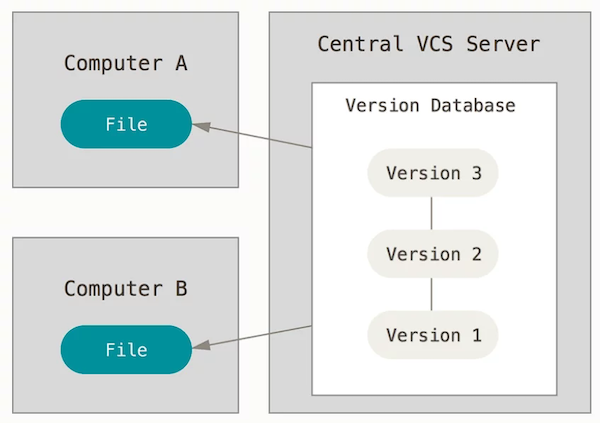
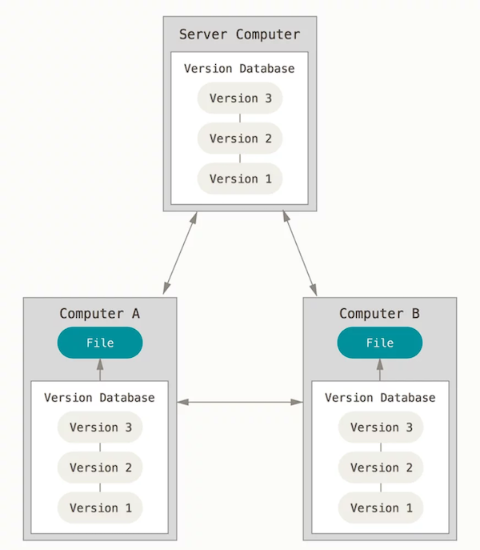
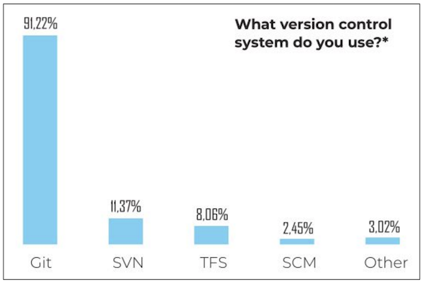
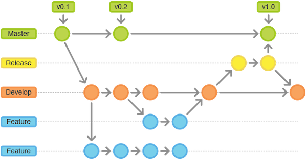
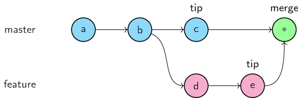
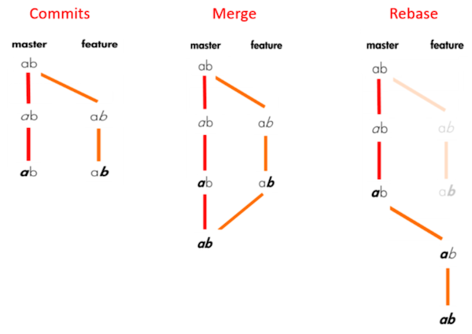

# Versioning with Git


## Objectives

Today, we will do:

- Learn what is versioning
- Git introduction
- Lab: Git basics

## What is versioning?

Also known as:

- Version Control or Version Control System (VCS)
- Source Control Management (SCM)

## What is versioning?

**It is the practice of tracking and managing changes to software code.**

**Version Control System (VCS)** (or **Source Control Management (SCM)**) - tools that help you keep track of your code with a complete history of changes.

It is now a standard in software development to maintain a **single source of truth** for development teams, which allows multiple developers to work on the same codebase.

## Why VCS?

- How to share the work?
- How to keep track of changes and their authors?

## What do you manage with VCS?

- Source code, or any **text-based** documents
- Project versions
  - Global project version (**tags**, like `1.2.4-beta`)
  - Each modification is a version!
- Change requests ("Pull requests" in GitHub)

## Semantic Versioning (SemVer)



Format: `MAJOR.MINOR.PATCH-LABEL`

- `MAJOR` - when you make incompatible API changes
- `MINOR` - when you add functionality in a backward-compatible manner
- `PATCH` - when you make backward-compatible bug fixes
- `LABEL` - optional, for pre-release and build metadata (extension to the MAJOR.MINOR.PATCH format)

Examples:

```
2.3.1
1.0.0-alpha
1.0.0-beta
```

[Read more about SemVer](https://semver.org/)

## What types of VCS?

- Centralized
- Distributed

## Centralized VCS



- Has a single central database (repository)
- Single point of failure
- Requires a network to inspect a history
  
Examples: Apache Subversion (SVN)

## Distributed VCS



- Local database (repository) with the full history
- Independent work

Examples: Git, Mercurial SCM

## What is Git?

- The most popular VCS
- Distributed
- Open Source and free
- Created in 2005 by Linus Torvalds

## Why learn Git?

- Git outclasses other SCM tools
- Git is obligatory to be mastered for everyone involved in software development processes



The information is from ["State of software development in 2019", codingsans.com](https://codingsans.com/state-of-software-development-2019).

## Git: Ecosystem

- Client tools:
  - `git` CLI (command-line interface)
  - GitHub Desktop
  - GitKraken
  - Sourcetree
  - Fork
  - etc...
- Repository hosting services:
  - GitHub
  - GitLab
  - Bitbucket
  - etc...

## Git: Basic concepts

- The Git project:
  - on your computer - **local repository**
  - in a remote location - **remote repository**
- Each set of changes to files in the history is a **commit**
- When choosing what to commit, files are **staged**
- Each commit has a **parent commit** (except for the first one)
- The current commit is the **HEAD**
- Retrieving commits from the remote repository is **pulling**
- Sending commits to the remote repository is **pushing**

[Official Git documentation](https://git-scm.com/doc)

## Git: Repository

- It is the `.git/` folder inside a project
- It tracks all changes made to files in your project
- It stores the entire history of changes
- Can be **local** and **remote**

> Note! If you delete the `.git/` folder, then you delete your project’s history.

## Git: Common usage scenario

1. Checking out remote changes:   
  `git clone` (very first time) or `git pull` (always afterward)
2. Editing a file:   
  E.g.: add a new function `attack()` to the `player.js` file
3. Adding a file to "staging area" for the next **commit**:   
  `git add player.js`
4. Commit the modification to the **local repository**:   
  `git commit -m "Add player attack"`
5. Send local modifications to the **remote repository**:   
  `git push`
6. Resolution of any **conflicts**:   
  File modification and commiting again (starting from step 3)

> Note! If you start a project from scratch you do `git init` to create a new repository

## Git: Branching

- **Branch** is an independent set of commits
- What makes Git so popular (it fits best to Agile and DevOps)
- Branch can be an abstraction for a line of development:
  - `master` (or `main`) is the first and default one, used to keep the stable and tested version of the project
  - `develop` is the place where features come together before merging to `master`
  - `feature_X` is a branch for a single feature "X"
- Branch can be temporary:
  - To have a change request
  - To develop an independent feature
    


## Git: Merging branches

- The branches are **merged** to have all the changes in only one branch (eventually in `master`)
- When changes conflict with each other, the merge fails:   
  ```
  Automatic merge failed; fix conflicts and then commit the result.
  ```



## Git: Resolving conflicts

- **Conflicts** are changes made on the same part of the same file in two branches
- Must be resolved manually:
  - edit files with a resolver tool (or text editor)
  - commit the files
  - push to the **remote branch**

## Now, it is a time for the lab work!

Pause reading here, do the [lab work](./lab.md), and come back later!

## Git: `.gitignore`

- The `.gitignore` file contains the files to be ignored by Git
- Works with [wildcards](https://en.wikipedia.org/wiki/Wildcard_character)   
  Eg: `.*` - ignore all files starting with a `.`
- Useful for ignoring files specific to your local development environment: 
  - Codeblocks or VScode configuration files
  - `./node_modules` folder in Node.js

## Git: Tagging

So far:

- changes are managed, but not the project
- all the commits come one after the other
- the only version available is the commit ID

**Tagging** versions:

- Tag a **commit** to be a particular software version
- It is easier to identify the versions
- You must **push** tags to the remote repository in the same way as commits

## Git best practices: use rebase instead of merge



[Read this article](https://medium.com/datadriveninvestor/git-rebase-vs-merge-cc5199edd77c).

## Git best practices: Conventional Commits

- It is a specification for writing commit messages
- The commit message should be structured as follows:
  ```
  <type>[optional scope]: <description>

  [optional body]

  [optional footer]
  ```
- Learn more [here](https://www.conventionalcommits.org/en/v1.0.0-beta.2/)

## Where can you use Git?

- Software development
- Writing (books, articles, theses)
- Whatever requires tracking the history...

## Open-source project management

How to contribute to an open-source project on GitHub?

1. **Fork** a repository to your account
2. Work on a change on your fork
3. Ask for your changes to be added to the original repository by creating a [pull request](https://help.github.com/en/github/collaborating-with-issues-and-pull-requests/about-pull-requests)
