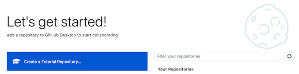
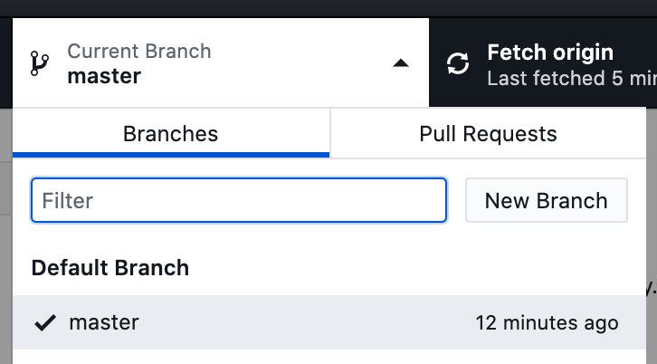
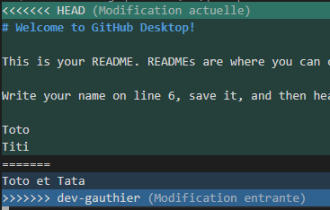
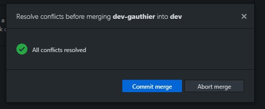

# Lab

This lab work covers the basics of Git.

## Objectives

This lab work can be done in a group of **2 students**.

1. Perform the GitHub Desktop Tutorial
2. Create a repository and clone it on your computer
3. Create a branch and navigate between branches
4. Modify a file in the repository and push the modifications
5. Manage conflicts
6. Redo the lab using command line interface (CLI)

## Before starting

1. Create a GitHub account: https://github.com/
2. Install GitHub Desktop from this url: https://desktop.github.com/
3. Install an IDE or a text editor (ex: https://code.visualstudio.com/ or https://atom.io/)

## 1. Perform the GitHub Desktop Tutorial

1. Launch GitHub Desktop
2. Start the GitHub Desktop Tutorial by clicking "Create a Tutorial Repository ..." and follow the instructions

## 2. Create a repository and clone it on your computer

**A single member** of the group creates a repository:

1. Login to [Github.com](https://github.com/)
2. Navigate to the **"Your repositories"** page
3. Click on **"New"**
  - Choose a name
  - Chose the **"Public"** option
  - Check the box **"Add a README file"**
  - Check the box **"Add .gitignore"** with the **"Node"** template
4. Navigate to the created repository, then to the **Settings → Manage Access** page
5. Click on **"Invite a collaborator"** and add the other members of your group

**All group members** clone the repository:

6. Open GitHub Desktop
7. Click on **"Clone a repository from the Internet"**
8. **GitHub.com** → Filter your repositories
10. Click on “Clone”

You now have a copy of the local repository

## 3. Create a branch and navigate between branches

**A single member** of the group creates the `develop` branch:

1. In GitHub Desktop: **Current branch → New branch**

2. Choose the name of the branch (`develop`) and **"Create branch"**

You can now navigate (= checkout) between the master and develop branches.

## 4. Modify a file in the repository and push the modifications

**A single member** of the group modifies the **"README.md"** file and pushes to the `develop` branch:

1. Modify the **"README.md"** file entirely:
  - Open the repository in your IDE
  - Replace the entire contents of the **"README.md"** file
2. In GitHub Desktop:
  - Choose a commit message ("Summary")
  - Click on **"Commit to develop"**
  - Use **"Publish branch"** to push your changes to the remote repository
  
**The other members** of the group get the changes:

3. Use **"Fetch origin"** to synchronize your local repository with remote changes
4. Navigate to the develop branch and watch your files change in your IDE

## 5. Manage conflicts

A conflict occurs when a part of a file has been modified on 2 branches which must be merged (**merge**). We will create a conflict to see how to resolve it.

Both **2 members** of the group create a branch from `develop` and modify the same part (same lines) of the **README.md** file:

1. Create a branch `dev-firstname` **"based on ... develop"**
2. Edit the **README.md** file
3. Commit changes
4. Push your changes

Alternately, each member merges the new branches into `develop`:

5. Checkout the `develop` branch
6. Click on **"Merge into current branch ..."**
7. Select branch
8. Push your changes
9. **The 2nd member** of the group will encounter a conflict:
  - Open your IDE as suggested by GitHub Desktop
  - The conflict materialize as follows:
  
  

  - To resolve the conflict, keep either the `HEAD` part, or the `dev-firstname` part and delete the other lines (including the `====` and `>>>>` lines)
  - Once the lines are deleted you can commit the merge from GitHub Desktop:

  

## 6. Redo the lab using command line interface (CLI)

The goal is to redo the same actions as before with the command line.
For this you must have a terminal and GIT installed by default on Linux or MacOS.

For the installation:
- Windows: https://gitforwindows.org/
- Linux: https://git-scm.com/download/linux
- MacOS: https://git-scm.com/download/mac

You can now open Terminal (on Linux or MacOS) or Git Bash (on Windows).

You can find a detailed list of the different Git CLI commands:
- https://gist.github.com/aquelito/8596717
- https://github.github.com/training-kit/downloads/github-git-cheat-sheet.pdf

## Bonus tasks

1. [Learn `.gitignore`](https://git-scm.com/docs/gitignore)
2. [Learn tagging](https://git-scm.com/book/en/v2/Git-Basics-Tagging)
3. [Learn "rebase" vs "merge"](https://medium.datadriveninvestor.com/git-rebase-vs-merge-cc5199edd77c)
4. [Learn Conventional Commits](https://www.conventionalcommits.org/en/v1.0.0-beta.2/)
5. [Learn squashing commits](https://medium.com/the-mighty-programmer/squashing-git-commits-4b53fe1c138e)
