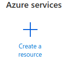
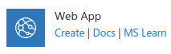
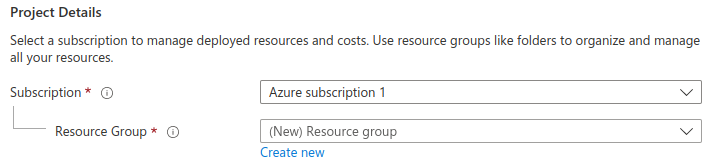
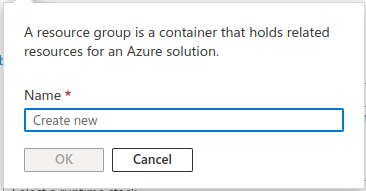
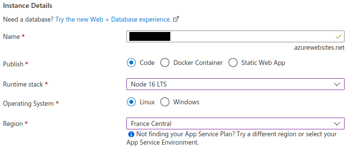
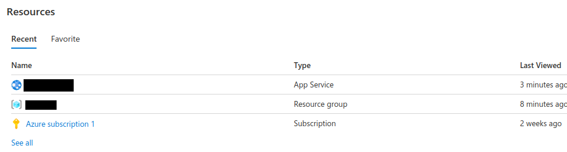
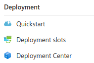
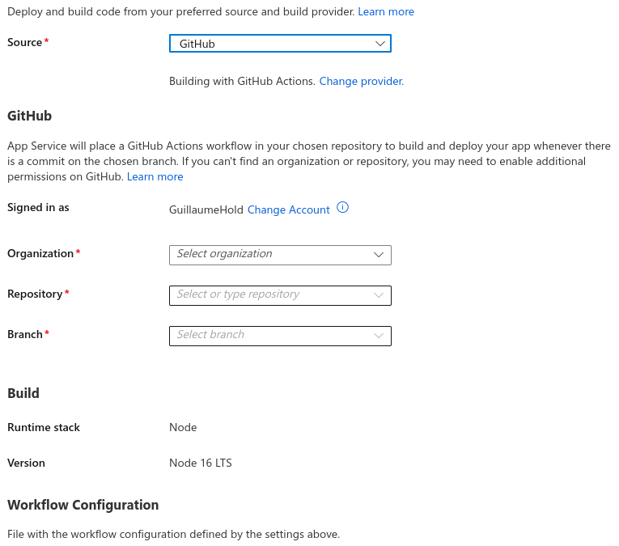
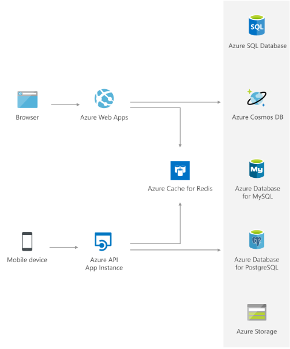

# Deploy your Nodejs application with Azure Application Services

## Create your account

First crate you account. You have two options:

- [Student account](https://azure.microsoft.com/en-us/free/students/) povides 100$ credits available for 1 year.
- [Free trial account](https://azure.microsoft.com/en-us/free/) povides 200$ credits available for 1 month.

Then connect to your [azure portal](https://portal.azure.com/)

## Create a Azure Web App

In the portal, you can create a new ressource by clicking on [create a ressource](https://portal.azure.com/#create/hub):



Next click on [Create](https://portal.azure.com/#create/Microsoft.WebSite) of the **Web App** service:



For the **Project Details**, select your subscription and create a new Resource Group by clicking [Create New](https://portal.azure.com/#create/Microsoft.ResourceGroup) and give it a name:





Then you need to select your instance details:



Provide:
- An unique **Name**
- Publish with **Code**
- **Runtime stack** for your web app (`Node 16` here)
- A Linux **Operating System**
- A **Region** close to your position (`France Central` here)

Leave the rest of the options by default and click on **Review + Create** at the bottom.

Confirm by clicking on **Create** and wait that the deployment is finished.

> NOTE: if this is not working due to the region quota, try other regions.

## configure your Node.js application

Azure Web App will provides its own ports that can be accessed with the [environement variables](https://learn.microsoft.com/en-us/azure/app-service/reference-app-settings?tabs=oryx%2Cdotnet). Our application will run on the port provided by the environement variable `PORT`.

In your `index.js` of your application, you need to configure the port of your server:

```javascript
const port = process.env.PORT || 3000
```

## Configuring the app

Go to [your Portal](https://portal.azure.com/#home) and open your created app service resource:



On the left, acess the **deployment Center** to configure the deployment:



In the **Source** option select **GitHub** and configure wich account, repository and branch you want to deploy:



click on save at the top to confirm. Azure will commit the wworkflow to your account and deploy the app.


## BONUS TASKS

You can add Databases to your application with the Azure services:



You can use [Redis Cache for Redis](https://azure.microsoft.com/fr-fr/products/cache/#overview) for deploying your Redis database. [Example](https://learn.microsoft.com/en-us/azure/azure-cache-for-redis/cache-nodejs-get-started)

You can also add a [CosmoDB](https://azure.microsoft.com/en-us/products/cosmos-db/#overview) database. [Example](https://learn.microsoft.com/en-us/azure/cosmos-db/nosql/tutorial-nodejs-web-app)

## Ressouces

Links:

- https://azure.microsoft.com/en-us/free/students/
- https://azure.microsoft.com/en-us/free/
- https://learn.microsoft.com/en-us/azure/app-service/deploy-github-actions?tabs=applevel
- https://learn.microsoft.com/en-us/azure/app-service/quickstart-nodejs?tabs=linux&pivots=development-environment-azure-portal
- https://azure.microsoft.com/fr-fr/products/cache/#overview
- https://learn.microsoft.com/en-us/azure/azure-cache-for-redis/cache-nodejs-get-started
- https://learn.microsoft.com/en-us/azure/cosmos-db/nosql/tutorial-nodejs-web-app
