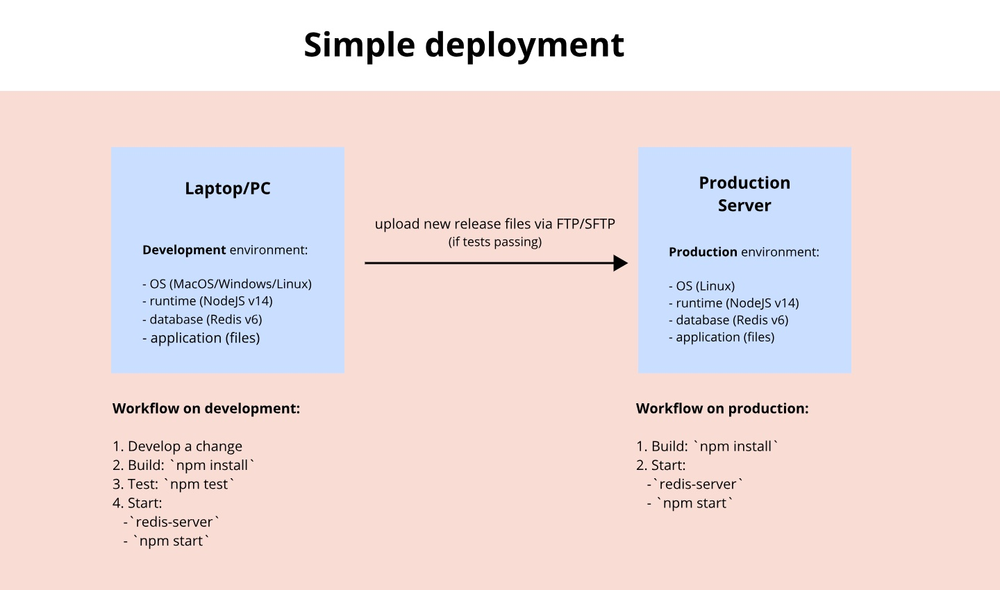
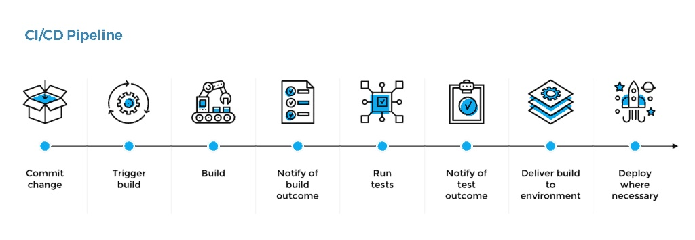
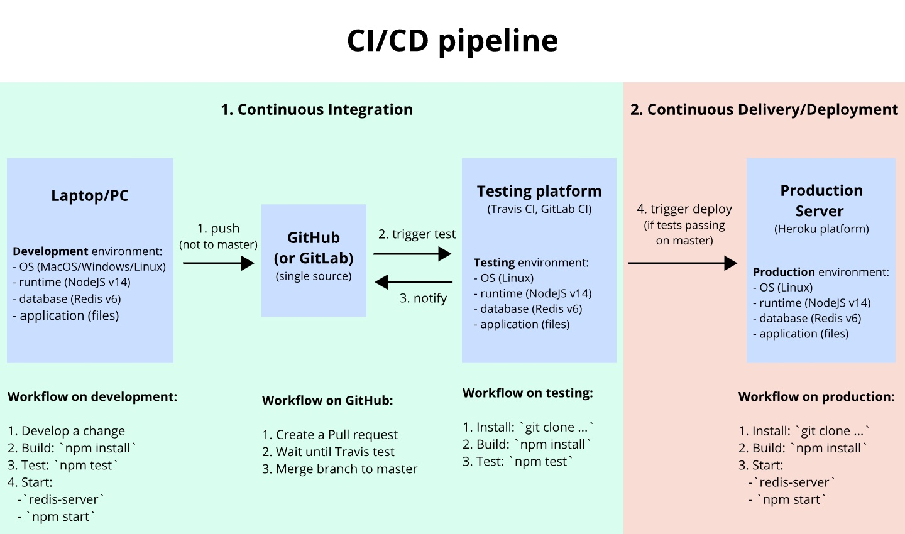

# Continuous Integration & Continuous Delivery (CI/CD)

CI/CD brings automation into the DevOps life cycle. With less manual work, DevOps teams work more efficiently and with greater speed. An automated workflow also reduces the chance of human error and improves handoffs, which improves overall operational efficiency. Organizations that implement CI/CD make better use of their resources and will have a competitive edge over those that don't use CI/CD.

## Simple deployment



## What is it?

**Continuous Integration (CI)** - a practice in which members of a team integrate their work frequently.

**Continuous Delivery (CD)** - a discipline where software is built in a manner that allows **deploying** to customers at any time.

**Continuous Deployment (CD)** - this **extends Continuous Delivery** by automating the deployment process so that code is automatically deployed to production after it passes automated testing.

## Benefits

- More time for innovation
- Better retention rates
- More revenue
- Business efficiency

## CI/CD Fundamentals

- **A single source repository**   
  Source code management (SCM) that houses all necessary files and scripts to create builds.
- **Automated builds**   
  Scripts should include everything you need to build from a single command.
- **Builds should be self-testing**   
  Testing scripts should ensure that the failure of a test should result in a failed build.
- **Frequent iterations**   
  Multiple commits to the repository mean there are fewer places for conflicts to hide.
- **Stable testing environments**   
  Code should be tested in a cloned version of the production environment.
- **Maximum visibility**   
  Every developer should be able to access the latest executables and see any changes made to the repository.
- **Automated deployments**   
  Code should be able to deploy into multiple environments easily.

## What is the CI/CD Pipeline?

**CI/CD pipeline** - an automated sequence of events that is initiated after you update the code.

Takes care of the work (that you would otherwise need to perform manually):

- previewing an in-development site
- testing a new code
- deploying it to a production server

## CI/CD pipeline



## CI/CD pipeline



## CI/CD tools

- Travis CI
- GitLab CI
- Jenkins
- ...

## Delivery to Registries

We can **deliver** new releases of the software to registries.

**Registry** - is a software package hosting service, that allows you to host your packages and code in one place.

Registry types:

- public
- private

### Example public package registries

- [NPM for JavaScript (NodeJS)](https://www.npmjs.com/)
- [MVN Repository for Java](https://mvnrepository.com/)
- [Python Package Index for Python](https://pypi.org/)

Examples of installing packages from a registry for using them in a project:
```bash
# For NodeJS
npm install <PACKAGE_NAME>

# For Java
mvn install <PACKAGE_NAME>

# For Python
pip install <PACKAGE_NAME>
pip3 install <PACKAGE_NAME>
```

### Example public Image registry

- [Docker Hub](https://hub.docker.com/)
  
### Example box registry for virtual machines
  
- [Vagrant Cloud](https://app.vagrantup.com/boxes/search)
  
## References

- [Continuous integration vs. continuous delivery vs. continuous deployment](https://www.atlassian.com/continuous-delivery/principles/continuous-integration-vs-delivery-vs-deployment)
