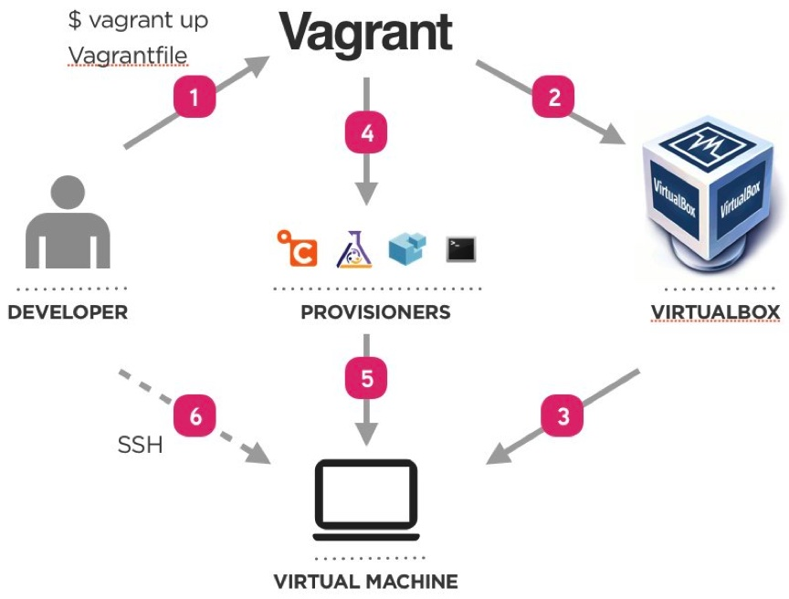
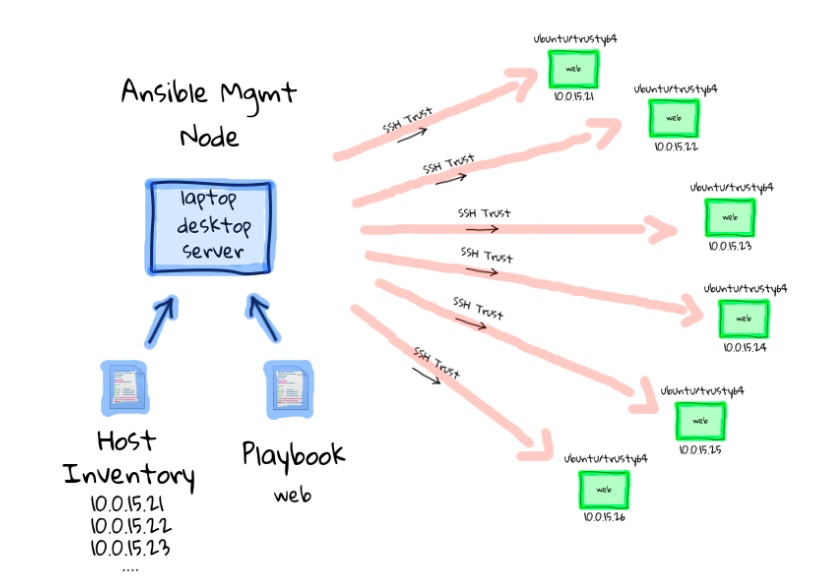

# Infrastructure as code (IaC)

Infrastructure as code (IaC) is a type of IT setup wherein developers or operations teams automatically manage and provision the technology stack for an application through software, rather than using a manual process to configure discrete hardware devices and operating systems.

## Requirement of automation

- Increasingly crucial to automate   
  Applications can be deployed up to hundreds of times per day.
- Infrastructure is fleeting   
  It can be provisioned or de-provisioned in response to load.

## Example

1. An application on a public cloud:
  - build on Kubernetes
  - bring on a VM (some legacy)
  - and add VPC to connect them
  
2. Then you need exactly the same test environment
  - manual repeating documented steps may contain human-factor errors 

## Imperative approach

Intuitive, step-by-step way.

**Example:**

CLI along with a bash script like:   

```bash
cli create vm
cli configure vm
...
cli create vpc
cli configure vpc
...
cli create db
cli configure db
...
```

**Disadvantages:**

- When you need to scale it up or down you need to write custom scripts.
- Doesn't scale well.
- If you run multiple times, it will create each time.
- You have to add error handling when one of the steps fails halfway.

## Declarative approach

- Define the final state of your infrastructure.
- It lets the provider handle the rest.
- Managed through simple config maps.

```bash
vm:
  config: ...
vpc:
  config: ...
db:
  config: ...
...
```

**Advantages:**

- No matter how many times you run provisioning you end up with the same infrastructure. Example: run it later to ensure the infrastructure hasn't changed

## Implementation in DevOps 

**Example:** 

Perfect agile DevOps flow:

- -> write code
- -> test
- -> deploy to production

With a legacy infrastructure:

- you have to open a ticket when you need a new VM
- that holds you back
  
With IaC (the best approach):

- you treat the infrastructure with the same quality as you treat your code
- versioning with Git
- tracking changes

## Immutable & mutable infrastructure

**Example:**

You add a database to your infrastructure: VM, VPC + database. Scale it 1000 times.

**Mutable approach** - environment (configuration) drift (move the infrastructure from V1 to V2 with a mutation **custom script**):

- 99% it is working, but 1% failing in a limbo state.
- Existing environment no longer matches what we have in our automation.
- To debug you would have to:
  - wipe out the entire environment
  - redeploy V1
  - run those scripts
- When moving to scale it becomes incredibly hard to maintain.

**Immutable approach** - a new environment alongside the old one:

- When they are both working you bring down the older version.
- It is expensive (V1 and V2 are running at the same time).
- But it's a best practice to ensure that your infrastructure can scale.

## Managing development virtual environment with Vagrant

**Vagrant** - a tool for building and managing virtual machine environments in a single workflow.

Benefits:

- automate prod-like environments
- easy to configure
- portable

## Vagrant workflow



## Vagrant components

- **host** and **guest** machines 
- **Vagrantfile** - configuration (on Ruby)
- **Box** - OS and version
- **Providers** - VM hypervisor (VirtualBox, VMware, libvirt)
- **Provisioners**:
  - shell
  - **Ansible**
  - Chef
  - Puppet
  - ...
  
## Vagrant basic commands

- `vagrant up` - Start and provision VM
- `vagrant destroy` - Destroy VMs
- `vagrant status` - Check VMs status
- `vagrant ssh <VM_NAME>` - SSH as the vagrant user
- `vagrant halt` - stop the VMs

## Vagrant Provisioners

Provisioners in Vagrant allow you to automatically install software, alter configurations, and more on the machine as part of the `vagrant up` process.

[Read more about Vagrant Provisioning](https://www.vagrantup.com/docs/provisioning)

## Provisioning with Ansible 

Ansible is an **automation engine** that automates:

- cloud provisioning
- configuration management
- application deployment
- intra-service orchestration
- many other IT needs ...
  
**Advantages:**

- no-agent to install on machines, SSH only
- write configuration (playbooks) on YAML - easy to learn
  
## Ansible components

- **Module** - units of code providing a narrow functionality (e.g. the `yum` module installs packages using the yum package manager).
- **Task** - execution of one module with a set of arguments.
- **Playbook** - set of tasks in YAML.
- **Role** - set of playbooks to be run on a group of hosts.
- **Host** - a machine that Ansible will configure through SSH.
- **Inventory** - definition of the hosts and variables to be used in the playbooks.



## Example Ansible project tree

```
run.yml
roles/
  common/
    tasks/
    handlers/
    files/
    templates/
    vars/
    defaults/
    meta/
  webservers/
    tasks/
    defaults/
    meta/
```

## Ansible variables

Ansible variables:

```yaml
postgres:
  host: psql.toto.com
  port: 5432
  timezone: Europe/Paris
  databases:
    - toto
    - tata
```

Ansible debug message:

```yaml
- debug:
  msg: "{{postgres.host}}: {{postgres.port}}"
```

Output:

```
ok: [server] => { 
  "msg": "psql.toto.com:5432" 
}
```

[Read more](https://docs.ansible.com/ansible/latest/user_guide/playbooks_templating.html) about Jinja2 templating.

## Cloud provisioning with Terraform

- By HashiCorp (same company as Vagrant)
- Manage all kinds of Cloud objects:
  - Machines/Containers
  - Networks
  - Services
  - Clusters
- Work with all Cloud providers: Azure, AWS, GCP, Alibaba Cloud ...

## Resources

References:

- [Vagrant Documentation](https://www.vagrantup.com/docs)
- [How Ansible Works](https://www.ansible.com/overview/how-ansible-works)

Videos:

- [What is Infrastructure as Code?](https://www.youtube.com/watch?v=zWw2wuiKd5o)
- [What is Ansible In Under 3 Minutes](https://www.youtube.com/watch?v=tWR1KXgEYxE)
- [002 Installing Ansible](https://www.youtube.com/watch?v=4xThcqDfbSA&list=PL4CwCXuy76Fe4Lll2ksYXGtupJNxpiBVV&index=2)
- [How Ansible works](https://www.youtube.com/watch?v=St__HLMZ8qQ)
- [Ansible: quick start video](https://www.ansible.com/resources/videos/quick-start-video)
- [Découvrir Ansible : outils d'orchestration et d'automatisation - ep01](https://www.youtube.com/watch?v=prtO-Ox8LW8)
