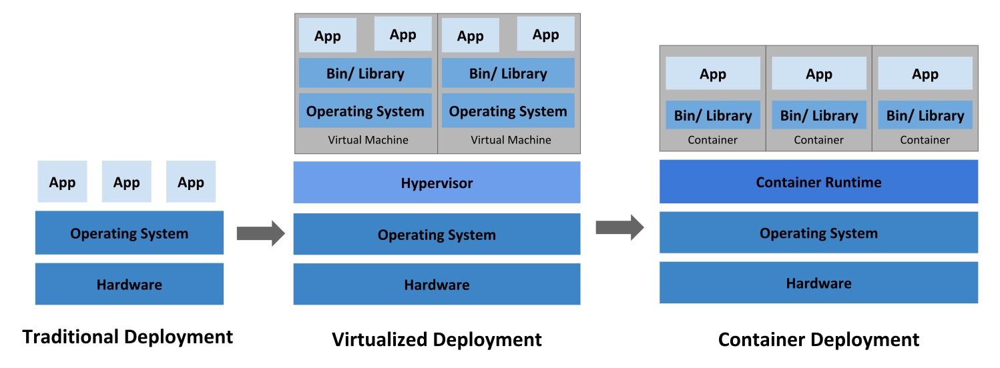
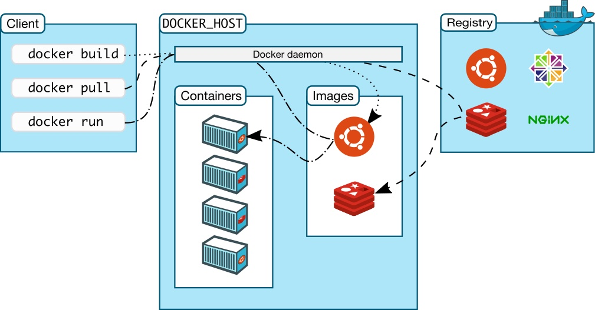
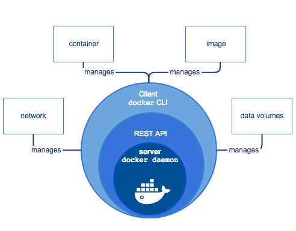
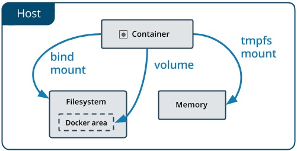

# Containers with Docker

Containers offer a logical packaging mechanism in which applications can be abstracted from the environment in which they actually run. This decoupling allows container-based applications to be deployed easily and consistently, regardless of whether the target environment is a private data center, the public cloud, or even a developer’s personal laptop. Containerization provides a clean separation of concerns, as developers focus on their application logic and dependencies, while IT operations teams can focus on deployment and management without bothering with application details such as specific software versions and configurations specific to the app.

## The problems for developers

- **Consistent environment**   
  Ability to create predictable environments that are isolated from other applications.
- **Run anywhere**   
  Ability to run virtually anywhere: on Linux, Windows, and Mac operating systems; on virtual machines or bare metal; on a developer’s machine or in data centers on-premises; in the public cloud.
- **Isolation**
  Ability to virtualize CPU, memory, storage, and network resources at the OS level, providing developers with a sandboxed view of the OS logically isolated from other applications.

## What are containers?

- Standardized unit of software that allows developers to isolate their application from its environment.
- Packages code and all its dependencies, so that the application runs quickly and reliably from one computing environment to another.
- Container platforms:   
  - **Docker**
  - LXC (Linux Containers)
  - rkt (CoreOS Rocket)

## Docker container

- Docker since 2013
- Became an industry standard
- Easy to use
- An excellent building block (for software delivery according to DevOps perspectives)

## Docker

  - **Portable anywhere** (Linux, Windows, Datacenter, Cloud, Serverless, etc.)   
  Docker created the industry standard for containers.
  - **Lightweight**   
  Containers share the machine’s OS system kernel and therefore do not require an OS per application, driving higher server efficiencies and reducing server and licensing costs.
  - **Secure**   
  Applications are safer in containers and Docker provides the strongest default isolation capabilities in the industry.

## Container vs Virtual Machines vs Bare metal



## Docker architecture



- client (CLI via REST API)
- server (Docker host) - daemon, containers, images, volumes
- registry - Docker Hub

## Docker components



**Docker engine:**

- Server (daemon process)
- REST API
- Client (CLI)

**Docker objects**

- Images
- Containers
- Networks
- Volumes
- ... some more objects

Docker objects are available to be observed and controlled using the command `docker <object-name>`.

## Example of a Docker workflow

1. Developers write code locally and share their work with their colleagues using Docker containers.
2. They use Docker to push their applications into a test environment and execute automated and manual tests.
3. When developers find bugs, they can fix them in the development environment and redeploy them to the test environment for testing and validation.
4. When testing is complete, getting the fix to the customer is as simple as pushing the updated image to the production environment.

## CLI commands

- `docker help` - explore commands
- `docker ps` - list running containers
- `docker run <CONTAINER_NAME>` - list running containers
- `docker container` - manage containers
- `docker image` - manage images
- `docker volume` - manage volumes
- `docker network` - manage networks
- `docker exec` - run a command in a running container

Example: `docker run -i -t ubuntu /bin/bash`

## Building Docker images

`Dockerfile` - configuration file for building images.

**Python:**

```
FROM ubuntu:15.04
COPY . /app
RUN make /app
CMD python /app/app.py
```

**Node.js:**

```
FROM node:12
WORKDIR /usr/src/app
COPY package.json .
RUN npm install
COPY . .
CMD [ "npm", "start" ]
```

To build an image:

```
docker build .
```

## Storage on Docker

By default, all the files created inside a container are stored on a writable container layer. This means:

- the data is not persistent
- You can’t easily move the data somewhere else



Storage types:

  - [volumes](https://docs.docker.com/storage/volumes/) - prefered
  - [bind mounts](https://docs.docker.com/storage/bind-mounts/)
  - [tmpfs mount](https://docs.docker.com/storage/tmpfs/)
  

Example:
```
docker run -v path/on/host:/app nginx:latest
```

## Running multi-container applications with Docker Compose

**Docker Compose**

- is a tool for defining and running multi-container Docker applications.
- Uses a compose (configuration) file   
- A way to document and configure all of the application’s service dependencies (databases, queues, caches, web service APIs, etc)
- Only one single command to create and start containers - `docker compose up`

## Use cases

1. **Development environments**   
  When you’re developing software, the ability to run an application in an isolated environment and interact with it is crucial. The Compose command-line tool can be used to create the environment and interact with it.

2. **Automated testing environments**   
  An important part of any Continuous Deployment or Continuous Integration process is the automated test suite. Automated end-to-end testing requires an environment in which to run tests. Compose provides a convenient way to create and destroy isolated testing environments for your test suite.

3. **Single host deployments**   
  To deploy to a remote Docker Engine.

## Using Docker Compose

A three-step process:

1. Define your app’s environment with a `Dockerfile` so it can be reproduced anywhere.
2. Define the services that make up your app in `docker-compose.yml` so they can be run together in an isolated environment.
3. Run `docker compose up` and Compose starts and runs your entire app.

## Docker Compose example

Installing WordPress website.

```yaml
version: '3.3'

services:
   db:
     image: mysql:5.7
     volumes:
       - db_data:/var/lib/mysql
     restart: always
     environment:
       MYSQL_ROOT_PASSWORD: somewordpress
       MYSQL_DATABASE: wordpress
       MYSQL_USER: wordpress
       MYSQL_PASSWORD: wordpress

   wordpress:
     depends_on:
       - db
     image: wordpress:latest
     ports:
       - "8000:80"
     restart: always
     environment:
       WORDPRESS_DB_HOST: db:3306
       WORDPRESS_DB_USER: wordpress
       WORDPRESS_DB_PASSWORD: wordpress
       WORDPRESS_DB_NAME: wordpress
volumes:
    db_data: {}
```

## Docker Compose commands

Base commands:

- `docker compose up` - Create and start containers
- `docker compose down` - Stop and remove containers, networks, images, and volumes
- `docker compose exec` - Execute a command in a running container
- `docker compose help` - Learn all possible commands

## Resources

References:

  - [Docker Documentation](https://docs.docker.com/)
  - [Containers at Google](https://cloud.google.com/containers)

Videos:

  - [Introduction To Docker and Docker Containers](https://www.youtube.com/watch?v=JSLpG_spOBM) (8 min)
  - [Docker Client, Images and Containers](https://www.youtube.com/watch?v=CcxbHkqzJuI) (14 min)
  - [Docker : l'essentiel en 7 minutes](https://www.youtube.com/watch?v=caXHwYC3tq8&t=1s) (7 min)
