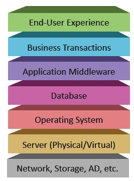
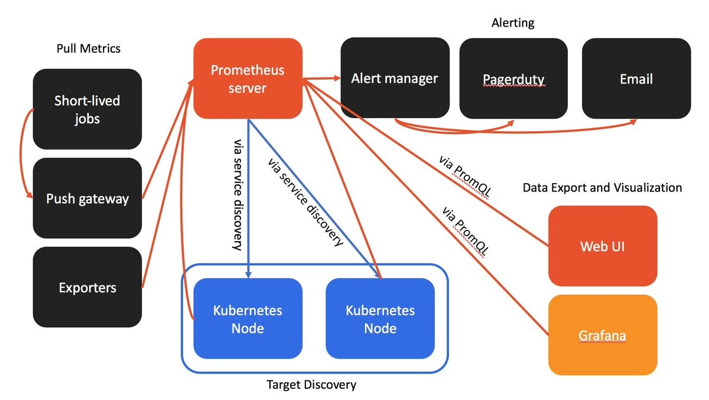
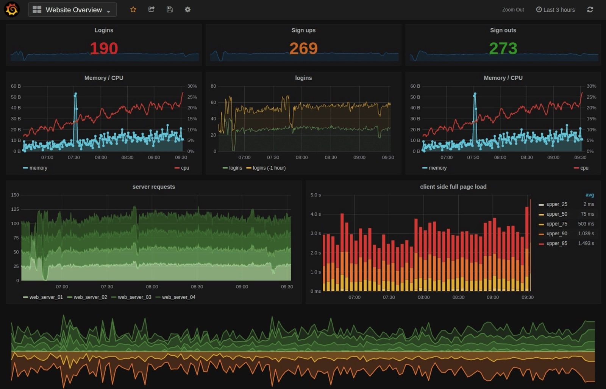

# Monitoring | with Prometheus and Grafana

The aim of DevOps is to remove silos between Development and Operations team. Once the application is deployed and is available for users, Monitoring will alert the teams if there are any application issues in that environment. This will provide necessary feedback to the team. And the team can understand the parts of the application that demand additional work.

## Requirements

- Frequent code changes demand visibility
- Automated collaboration
- Experimentation
- Change management
- Dependent system monitoring

[Read more](https://www.atlassian.com/devops/devops-tools/devops-monitoring)

## Types of Monitoring

- Infrastructure monitoring (hardware, network, OS, ...)
- Application monitoring (uptime, performance, security-monitoring, log-monitoring, health, ...)
- Network monitoring (routers, firewalls, servers, switchers, VMs)

## Monitoring

- Gather data from all layers
- Periodic measurements
- Event based
- Stored on a monitoring database
- Logs are stored as well
- Alert when logs are out of bound

## Prometheus

Open-source monitoring solution, built primarily for gathering and analysing time-series data

**Features:**

- Scrapes data, stores it, and supports queries, graphs, and alerts
- Lowers development environment setup time
- Works seamlessly with Mac, Windows, and LINUX.
- Very popular for monitoring containerised environments (Docker, Kubernetes)
- Integrates with existing configuration tools like Chef, Puppet, Ansible, Salt.
- Creates a single file for projects to describe which kind of machine and software users want to install.

## Grafana

Open-source platform for monitoring and observability.

**Features:**

- Visualize
- Dynamic Dashboards
- Explore Metrics
- Explore Logs
- Alerting
- Mixed Data Sources

